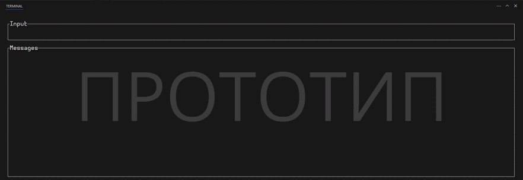

# Dispatch

**Dispatch** — программный комплекс, обеспечивающий общение пользователей в общем чате. Проект направлен на создание безопасного и масштабируемого чат-приложения с поддержкой регистрации/авторизации пользователей и асинхронного взаимодействия между клиентом и сервером.

# Данные
1. **Пользователи:**
   - Поля: имя пользователя, хешированный пароль, уникальный идентификатор.
   - Ограничения: имя пользователя должно быть уникальным, пароль — хеширован и не хранится в открытом виде.
2. **Сообщения:**
   - Поля: содержание сообщения, время отправки, отправитель.
   - Ограничения: размер сообщения ограничен, формат должен поддерживать текстовые данные.

# Роли
**Пользователь:**
   - Ответственность: отправка сообщений в общий чат.

# UI
- **UI:** Разработка с использованием библиотеки `ratatui` для создания текстового интерфейса клиента.

# Стек технологий
- Rust, основа для всего программного комплекса:
  - Создание текстового пользовательского интерфейса (TUI) с использованием библиотеки Ratatui.
  - Добавление асинхронности с помощью библиотеки Tokio.
- PostgreSQL: хранение данных пользователей и истории чата.

# Тестирование
Тестирование находится на этапе планирования.
