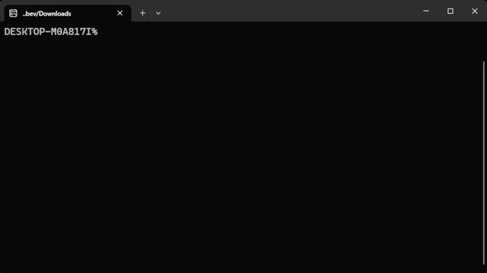

# `Dispatch`

**`Dispatch`** — это платформа для общения пользователей в одном общем чате. Проект фокусируется на создании безопасной, устойчивой и масштабируемой платформы, а также на асинхронном взаимодействии между клиентом и сервером. Платформа предлагает минималистичный и интуитивно понятный интерфейс, оптимизированный для быстрого общения в реальном времени.

   

## Обзор

Проект использует `rust workspaces` для разделения на два модуля, каждый из которых имеет свой `README.md`с описанием архитектуры и функциональности.

- **[`backend`](./backend/):** Одноэкземплярный чат-сервер, построенный на `tokio`. Управляет подключениями пользователей и обменом сообщениями через `WebSocket`.
- **[`frontend`](./frontend/):** Текстовый интерфейс (TUI), реализованный с использованием библиотеки `cursive`. Интерфейс позволяет пользователю удобно обмениваться сообщениями в чате, с поддержкой навигации и взаимодействия в реальном времени.

## Лицензия
Проект распространяется под [`MIT License`](./LICENSE)