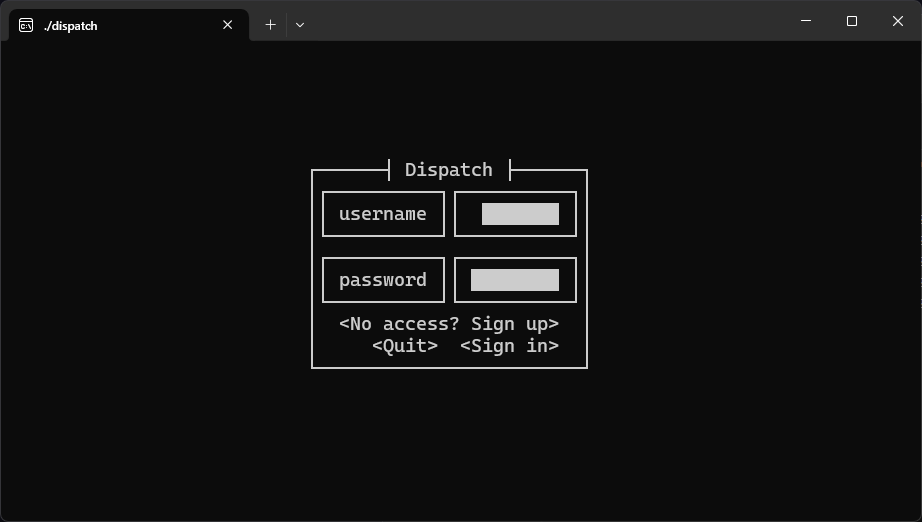
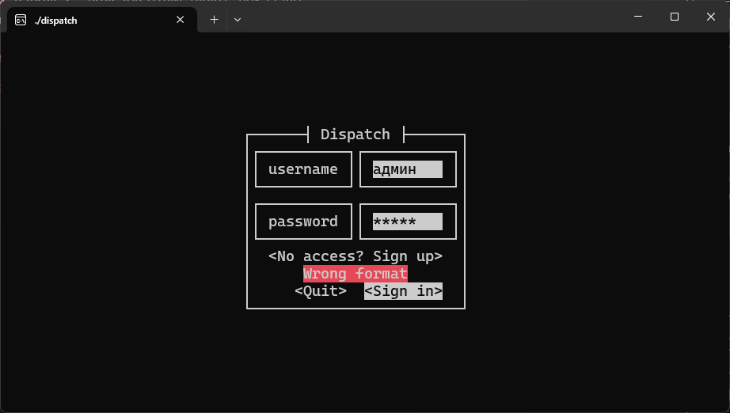
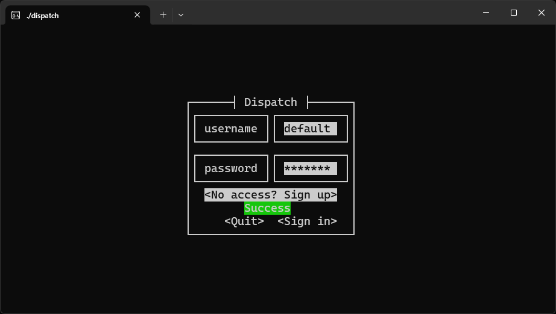
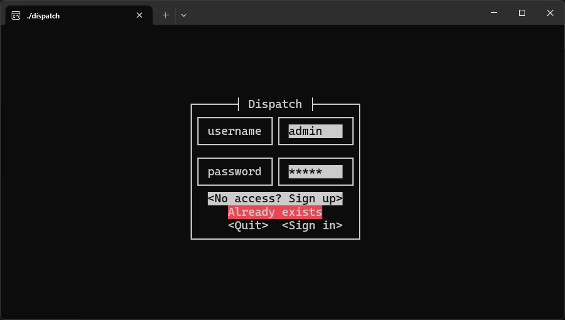
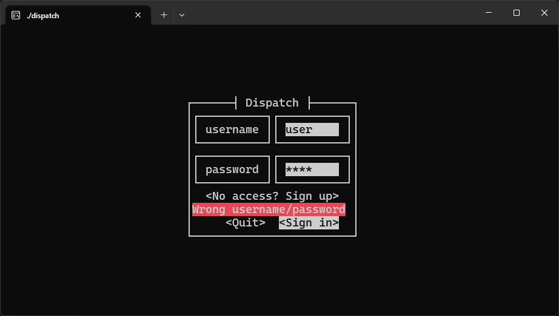
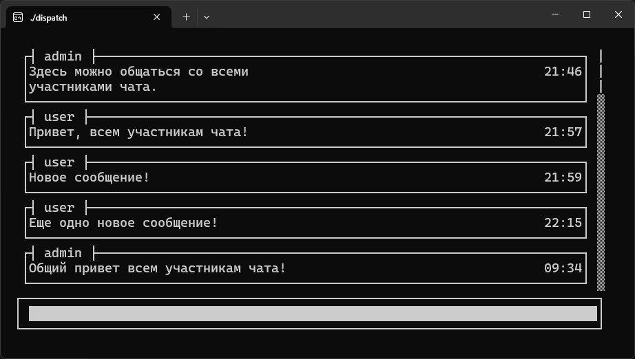

# `Frontend`
Предоставляет удобный и минималистичный терминальный интерфейс (TUI), написанный на Rust с использованием библиотеки `cursive`. Отправляет на сервер `POST`-запросы для регистрации и авторизации, а также устанавливает `WebSocket`-соединение с помощью `tokio-tungstenite`.


### **`Main Menu`**
Главное меню содержит поля для ввода логина, пароля и кнопки для входа/регистрации

<div style="text-align: center;">
   
</div>

---

### **`Connection Error Handling`**
В случае проблемы с подключением к серверу отображается сообщение об ошибке `Failed connection`

<div style="text-align: center;">
   
</div>

---

### `Input Format Validation`
Если введённые данные не соответствуют требованиям, появляется сообщение об ошибке `Wrong format`. Требования включают: поля не должны быть пустыми, длина логина и пароля должна быть от 1 до 8 символов, допустимы только ASCII-символы

<div style="text-align: center;">
   
</div>

---

### `Registration Success`
Успешная регистрая подтверждается сообщением `Success`

<div style="text-align: center;">
   
</div>

---

### `User Already Exists`
Если пользователь пытается зарегистрировать имя, которое уже существует в системе, отображается ошибка `Already exists`

<div style="text-align: center;">
   
</div>

---

### `Duplicate Connection`
Если пользователь пытается войти, находясь уже подключённым, то TUI отображает сообщение об ошибке `Already in`

<div style="text-align: center;">
   
</div>

---

### `Invalid Credentials`
При вводе неправильного логина или пароля отображается сообщение об ошибке `Wrong username/password`

<div style="text-align: center;">
   
</div>

---

### `Chat Interface`
После успешного входа в систему и подключения через WebSocket пользователю открывается окно чата, где в реальном времени отображаются все сообщения

<div style="text-align: center;">
   
</div>

---

## **`Build and Deployment`**
```bash
cargo build -p frontend --release
target/release/frontend --host localhost:3000
```